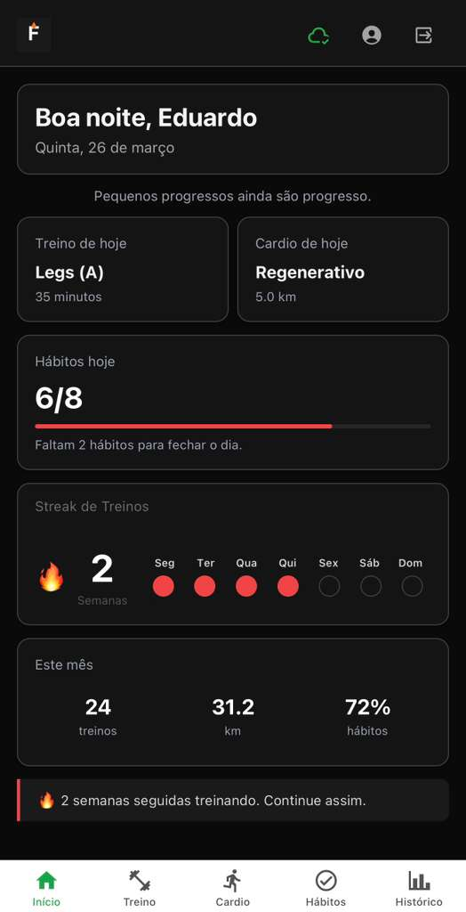
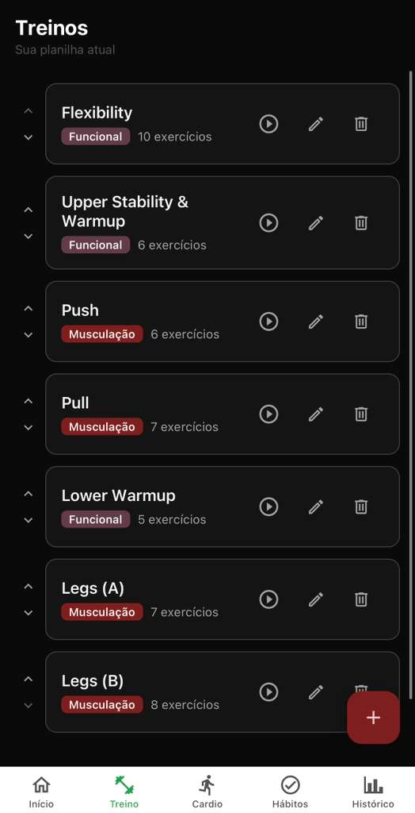
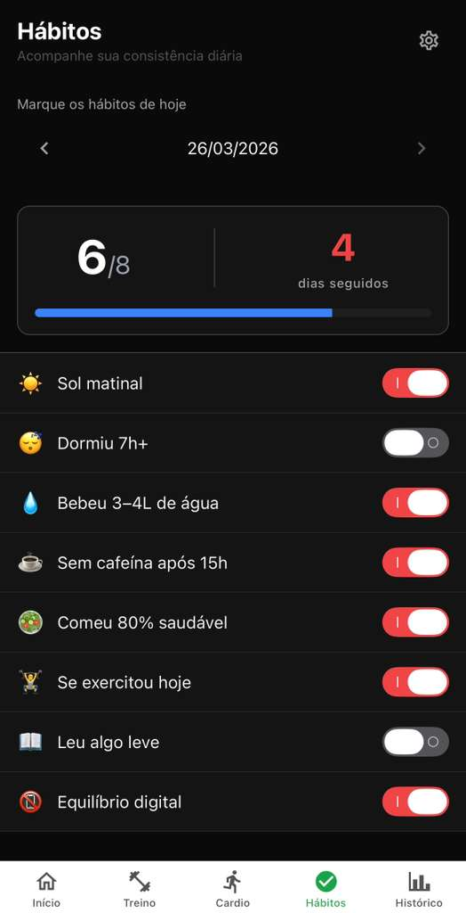
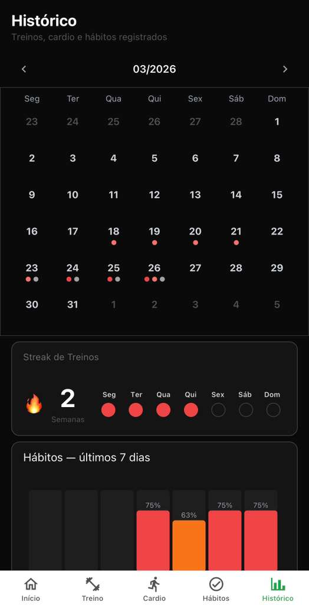

# Forja — Workout & Habit Tracker

A full-stack mobile app for people who train seriously and want to track workouts step-by-step and monitor daily health habits — all in one place, offline-first, with no bloat.

> Built with React Native / Expo · TypeScript · Supabase · Zustand

---

## Screenshots

| Home | Workout | Habits | History |
|------|---------|--------|---------|
|  |  |  |  |

---

## The Problem

People who train seriously still use spreadsheets mid-workout — slow, inconvenient, breaks focus. No app combines structured workout execution with a daily health protocol check in a simple, offline-first way.

---

## What it does

**Workout Tracker**
- Create custom workout templates (Push / Pull / Legs / custom)
- Execute workouts step-by-step: exercise → set → configurable rest timer → next set
- Freely reorder or skip exercises mid-session
- Auto-detect PRs (personal records) at session end
- Session summary with volume and PRs hit

**Daily Habit Check**
- 8 customizable daily habits with emoji + toggle
- Daily score (X/N) and streak counter
- Date navigation — view and edit yesterday's check
- Push notification reminder at 9pm

**Cardio Log**
- Log runs, rides, swims with training type (Regenerative / Intervals / Long / Walk) and heart rate zone (Z1–Z5)
- Distance, pace, avg HR, notes
- Filter by category

**History & Progress**
- Monthly calendar with color-coded activity dots (workout / cardio / habits)
- Weekly streak card (consecutive weeks with at least 1 active day)
- Habit score line chart (last 7 days)
- PR progression per exercise

**Sync**
- Offline-first: all data writes locally first
- Background sync to Supabase when online
- Sync status indicator in header

---

## Tech Stack

| Layer | Technology | Why |
|-------|-----------|-----|
| Framework | Expo (React Native) + TypeScript | iOS + Android from one codebase, familiar React DX |
| Navigation | Expo Router | File-based routing, same mental model as Next.js |
| UI | React Native Paper + custom dark theme | Accessible components, fast iteration |
| State | Zustand | Minimal boilerplate, works outside React components |
| Local storage | AsyncStorage | Offline-first, Expo Go compatible for beta testing |
| Backend | Supabase | Auth + PostgreSQL + Realtime, free tier covers MVP |
| Sync | Custom sync service | Fire-and-forget upsert, last-write-wins strategy |
| i18n | i18next | PT-BR default, EN structure ready for v2 |
| Notifications | Expo Notifications | Daily habit reminder at 9pm |

---

## Architecture

Feature-based architecture with strict layer separation.

```
src/
├── app/                    # Expo Router screens (thin — composition only)
│   ├── (auth)/             # Login, register
│   ├── (tabs)/             # Main tab screens
│   └── workout/            # Active session, template edit
│
├── core/                   # Shared infrastructure
│   ├── auth/               # Supabase auth + Zustand store
│   ├── sync/               # Background sync service + status indicator
│   ├── providers/          # App providers (theme, i18n, notifications)
│   ├── theme/              # Design tokens (colors, modal styles)
│   └── i18n/               # Translations
│
└── features/               # Business logic by domain
    ├── workout/             # Templates, exercises, active session
    │   ├── components/
    │   ├── hooks/
    │   ├── services/        # AsyncStorage I/O
    │   ├── store/           # Zustand session store
    │   └── types/
    ├── cardio/
    ├── habits/
    ├── history/
    └── onboarding/
```

**Data flow rule (ADR 007):**
```
service → hook → component → screen
```
Services never import React hooks. Hooks never call services from other features directly. Screens are thin — composition only.

---

## Key Architecture Decisions

All decisions documented in [`docs/adr/`](./docs/adr/).

| # | Decision | Choice | Reason |
|---|----------|--------|--------|
| 001 | Mobile framework | Expo (React Native) | iOS + Android, no PWA limitations |
| 002 | Offline strategy | AsyncStorage → WatermelonDB in v2 | Expo Go compatible for beta testing |
| 003 | Backend | Supabase | Free tier, Auth + DB + Realtime in one |
| 004 | State management | Zustand | No boilerplate, works outside components |
| 007 | Architecture | Feature-based | Each domain self-contained, scales without refactors |
| 010 | Sync trigger | Standalone function from store | Avoids cross-domain hook dependencies |

---

## Getting Started

### Prerequisites
- Node.js 18+
- Expo CLI (`npm install -g expo-cli`)
- Expo Go app on your phone ([iOS](https://apps.apple.com/app/expo-go/id982107779) / [Android](https://play.google.com/store/apps/details?id=host.exp.exponent))

### Setup

```bash
# Clone the repo
git clone https://github.com/EduardoVisconti/forja.git
cd forja

# Install dependencies
npm install

# Create environment file
cp .env.example .env
# Add your Supabase URL and anon key
```

### Supabase Setup

1. Create a project at [supabase.com](https://supabase.com)
2. Run the migration: `supabase/migrations/001_initial_schema.sql`
3. Copy your Project URL and anon key to `.env`

### Run

```bash
# Start development server
npx expo start

# Or with tunnel (for testing on different networks)
npx expo start --tunnel
```

Scan the QR code with Expo Go on your phone.

---

## What I Learned Building This

**Offline-first is harder than it looks.** Deciding that AsyncStorage is the source of truth — not the backend — changes every architectural decision downstream. Syncing is a background concern, not a primary one.

**ADRs save hours of future debugging.** Every time I hit a dependency conflict or a pattern question, having a documented reason for each choice let me make decisions confidently instead of revisiting them.

**Feature-based architecture pays off immediately.** When bugs appeared in cardio, I touched only `src/features/cardio/`. Nothing else broke. At milestone 8 I added an entirely new feature (history) without touching any existing code.

**Dark mode needs to be designed from day 1.** Retrofitting a dark theme at the end of a project means touching every component file. A `tokens.ts` file with all colors from the start would have saved hours.

**Mobile UX is unforgiving.** Issues that are invisible in a browser simulator — rest timers, touch gesture conflicts inside modals, iOS safe area overlaps — only appear on real devices. Test on hardware early and often.

---

## Roadmap

- [ ] EAS Build — distribute via TestFlight and Google Play
- [ ] Apple Health integration (HealthKit)
- [ ] Auto-check "Exercised" habit when workout is completed
- [ ] Workout history with manual add/delete entries
- [ ] PR comparison — green/red indicators vs previous session
- [ ] Personal trainer → student plan sharing (v2)
- [ ] WatermelonDB migration for full offline sync (v2)

---

## Project Structure Deep Dive

If you want to understand a specific part:

- **Auth flow:** `src/core/auth/` + `src/app/(auth)/`
- **Active workout session:** `src/features/workout/store/workoutSessionStore.ts` + `src/features/workout/hooks/useActiveSession.ts`
- **Sync strategy:** `src/core/sync/syncService.ts` + `docs/adr/002-offline-strategy.md`
- **Habit check with streak:** `src/features/habits/hooks/useHabitCheck.ts`
- **History aggregation:** `src/features/history/services/historyService.ts`

---

## Author

Eduardo Visconti — Frontend Developer based in Tampa, FL  
[LinkedIn](https://linkedin.com/in/eduardo-visconti) · [GitHub](https://github.com/EduardoVisconti)

> Available for frontend and React Native roles. Open to US-based and remote positions.
